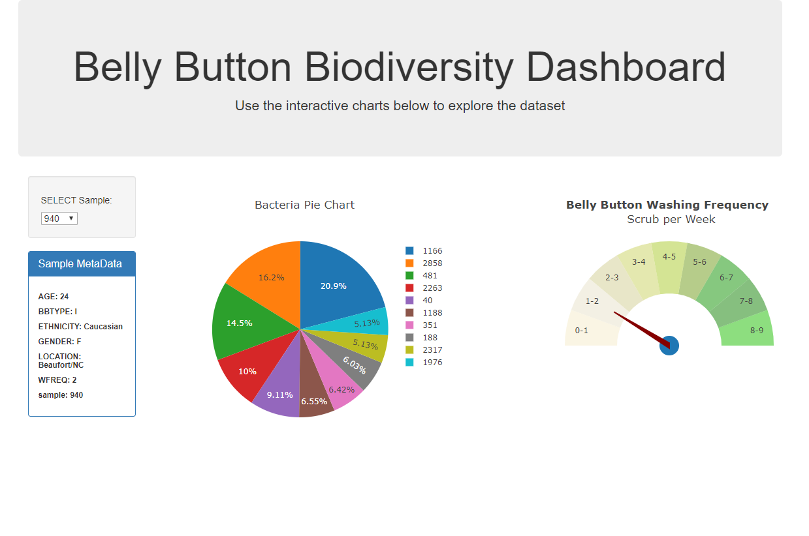

##Belly Button Biodiversity Dashboard

The purpose of this project is to build and deploy an interactive dashboard using Flask and Plotly.js. You can choose which belly button samples to investigate!

[Live web app](https://interactive-bio-dashboard.herokuapp.com/)

## Resources 
- Data has been kindly provided by UC Berkeley's Data Analytics and Visualization

## Author 
- Neal Zheng